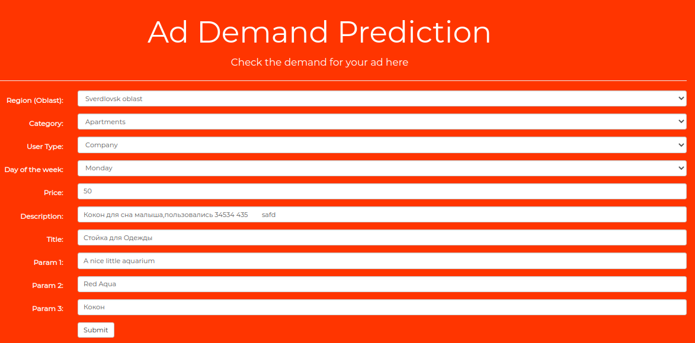
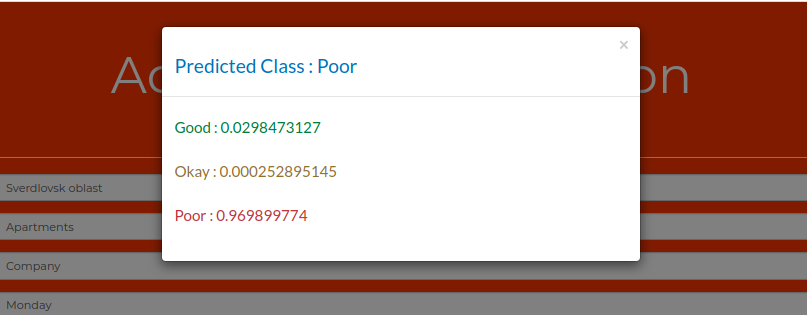

# Rating Classified Advertisements 

**Problem Statement :**
Classified advertising is the most common form of advertisement in newspapers, online websites and other periodicals. Classified advertisements are much cheaper than larger display advertisements and thus the need for it is always there. When the space for these ads is limited, a combination of tiny, nuanced details in a product description can make a big difference in drumming up interest.
Even with an optimized product listing, demand for a product may simply not exist–frustrating sellers who may have over-invested in marketing. Thus, there is a need to predict the demand for an item that the seller is advertising based on the market and also title, description, images, geo-location, etc. Rating these advertisements based on the demand predicted could help the sellers analyse and optimise the ads. Better the ratings, better is the probability that the item will be sold. It also helps the publishers rank these ads based on ratings and geo-location. 

**Dataset :**
	Avito is Russia’s largest classified advertisements website. The dataset for this problem statement is available in Kaggle as a part of this competition put up by [Avito](https://www.kaggle.com/c/avito-demand-prediction/data). The compressed version entire dataset which comprising csv files, images of test and train data is 123 GB. Uncompressed version would be around 250 to 300 GB. The data can be acquired by using Kaggle API.

**Approach :**
	Advertisements are being rated on a scale from poor to excellent (poor, below average, average, above average and excellent). There shall be classification of these ads based on demand. 
An advertisement with Excellent rating tells that there is a high probability that the item will be sold.  And an ad with poor rating tells the seller that he has to improve on the details provided by him and there is a low probability that the item will be sold.
Rating is  based on its full description (title, description, images, etc.), its context (geographically where it was posted, similar ads already posted) and historical demand for similar ads in similar contexts.
As the past data is provided in the data set, it is a supervised problem. 
As the ads are being rated on a scale from poor to excellent (poor, below average, average, above average and excellent), there shall be classification of these ads based on demand. It is a classification problem. 
Deep learning approach will be followed to solve this problem as it involves images, text and requires layering.

**Final Deliverable :**
	The final deliverable will be helpful for the sellers to improve their ads eventually helping them to sell their items and better deals. It would also help the publishers or ad listing agencies to rank various ads based on ratings.
API call with request body containing full description of the ad along with images if needed and geo-location would be returning the rating of the ad. 
Simple web-page will be developed . It would be having a form to input all the ad details and the rating based on demand would be obtained on submitting form.
A complete report on the solution

**Computational Resources :**
	Google’s Colaboratory (Co-lab) having a Jupyter environment will be used for the project as it has 13 GB of RAM and provides CPU and GPUs. It also has 350 GB of disk space. The data used for the project is at max 300 GB and thus, co-lab should be sufficient.

**Directory Structure :**
- __app__ : It contains final user application. A flask API, UI is exposed. Directions to install and deploy provided.
- __architecture__ : The cloud architecture of the ML model from all phases in the projects lifecycle described. It also has some images.
- __data-collection__ : Steps used for collecting data and transfer to GCP DataStore bucket.
- __data-preprocessing__ : Contains exploratory jupyter notebooks data analysis. EDA is performed, data is preprocessed and stored in GCP Cloud Storage.
- __notebooks__ : Jupyter notebooks used for training using traditional ML Algorithms, Apache Spark and Tensorflow.
- __training__ : Best performing Tensorflow w2v Embeddings model is selected and refactored into clear training project for production and advancements. It also contains steps used to deploy TF model to production.

**Application in Production :**
The AdDemand Application is avaiable [here](https://tensorflow-283115.wl.r.appspot.com/).
     
__Prediction From UI:__

__Prediction Response:__

