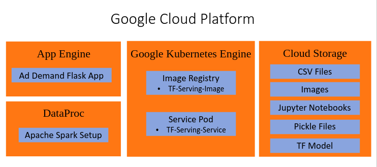
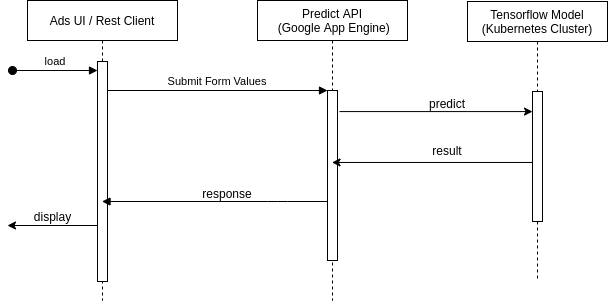
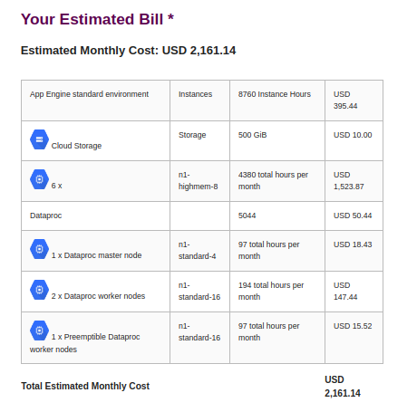

## AdDemand Application
### Google Cloud Platform
Here is an overview of the components used from data pre-process to deployment:

**DataProc :** This component was used in data pre-processing and for developing ML models on Apache Spark for the large CSV files. More details are in [spark data-preprocessing notebook](https://github.com/niteeshhegde/classified-ad-demand/blob/master/data-preprocessing/dataprep-pyspark.ipynb) and [pyspark models](https://github.com/niteeshhegde/classified-ad-demand/tree/master/notebooks/spark)

**Cloud Storage Bucket :** The entire dataset consisting of CSV files and Images are stored here. There are jupyter notebooks for each stage from pre-processing to deep learning. The processed data in separate CSV files are also stored. It also has pickle files from StandardScalar, tokenizer, ml model, etc. The Russian word vectors are also stored here. The final tensorflow model artifact in saved model format is also present here.

**App Engine :** AdDemand Flask application is deployed on AppEngine as [detailed here](https://github.com/niteeshhegde/classified-ad-demand/tree/master/app).

**Google Kubernetes Engine:** GKE is used to deploy the Tensorflow model using TF-Serving as [detailed here](https://github.com/niteeshhegde/classified-ad-demand/tree/master/app).

### Sequence Diagram 
Here is the sequence diagram for the application:

1. Client loads the AdDemand application hosted on https://tensorflow-283115.wl.r.appspot.com/

2. Fill in and submit the form calling a POST request to /api/predict.

3. Flask server cleans up and pre-processes the data and calls [Tensorflow model](http://35.199.176.26:8501/v1/models/my_saved_model:predict)

4. The TFModel predicts the output and returns the response to the flask application.

5. Flask application then logs the request and response for future enhancements, computes the majority class and return its response too the client.

6. The client then displays the predicted class along with probabilities of all classes.

### Enhancements:
1. Each Request, Response along with logging will be stored in a separate CSV files along with timestamps.

2. As and when the ad gets sold or taken down these values based on ad-ids shall go through a validation as a process of continuous enhancement to the model.

3. Better model found during this phase is added to saved model asa new version which gets picked up for the further predictions.

### Frequency of Use:
As Avito is the largest ad platform of Russia the number of ads posted each day is in thousands. The model is used each time a new ad is posted.
 
### Cost of the model:
Here is the monthly cost estimate for a minimal requirements of the model in production.

